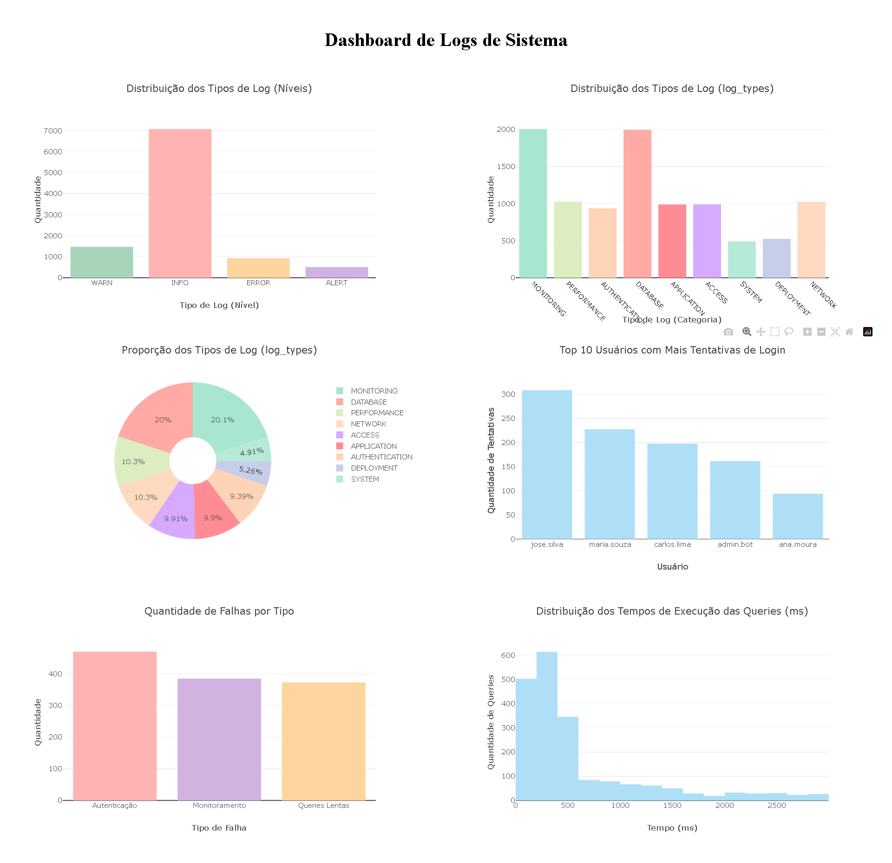

# 📊 Dashboard de Análise de Logs de Sistema

Este projeto é um **dashboard** feito com **Dash** e **Plotly**, que analisa arquivos de logs de sistemas.

---

## 🚀 Tecnologias Utilizadas

- Python 3.8+
- Dash
- Plotly
- Collections (Counter)
- HTML/CSS (estilização via Dash)

---

## 📋 Funcionalidades

- 📈 **Distribuição dos Tipos de Log (Níveis)**: INFO, ERROR, WARN, ALERT.
- 📚 **Distribuição dos Tipos de Log (log_types)**: APPLICATION, ACCESS, AUTHENTICATION, DATABASE, SYSTEM, NETWORK, PERFORMANCE, DEPLOYMENT, MONITORING.
- 🥧 **Gráfico de Pizza** mostrando a proporção dos tipos de log.
- 👤 **Top 10 Usuários** com mais tentativas de login.
- 🔥 **Falhas encontradas**:
  - Falhas de autenticação.
  - Falhas de monitoramento.
  - Queries lentas (acima de 1000ms).
- 🕑 **Histograma dos Tempos de Execução de Queries**.

---

## 🛠️ Como Rodar o Projeto

1. Clone o repositório:
   ```bash
   git clone https://github.com/seu-usuario/seu-repositorio.git
   cd seu-repositorio
   ```

2. Instale as dependências:
   ```bash
   pip install dash plotly
   ```

3. Certifique-se de ter um arquivo de log chamado **`logs_exemplo.txt`** na raiz do projeto.

4. Execute a aplicação:
   ```bash
   python app.py
   ```

5. Acesse no navegador:
   ```
   http://127.0.0.1:8050/
   ```

---

## 📄 Estrutura do Projeto

```
├── app.py             # Código principal da aplicação Dash
├── logs_exemplo.txt   # Arquivo de logs usado para análise
├── README.md          # Documentação do projeto
```

---

## 📸 Screenshot



---

## 📚 Sobre o Projeto

Este dashboard foi criado para facilitar a **visualização de problemas**, **análises de usuários**, e **desempenho** a partir de arquivos de log e ele faz parte da disciplina de Monitoramento de Logs para minha especialização em engenharia de software.

---

## 👨‍💻 Equipe

- **Anderson do Nascimento Pereira** - 2329073
- **Benjamim Girão de Freitas Neto** - 2418825
- **Glauber de Sousa Fernandes** - 2417566
- **Isaias Soares do Rego Fontes** - 2417052
- **Rodrigo Alves Freitas** - 2419157

---

## ⭐ Se Gostar do Projeto

Deixe uma ⭐ no repositório!  
Isso me motiva a criar mais projetos como esse! 🚀

---
